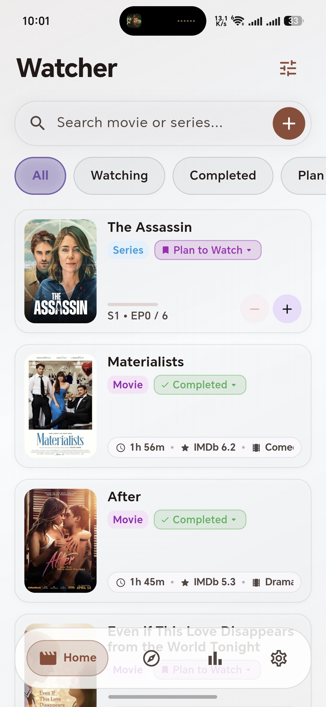
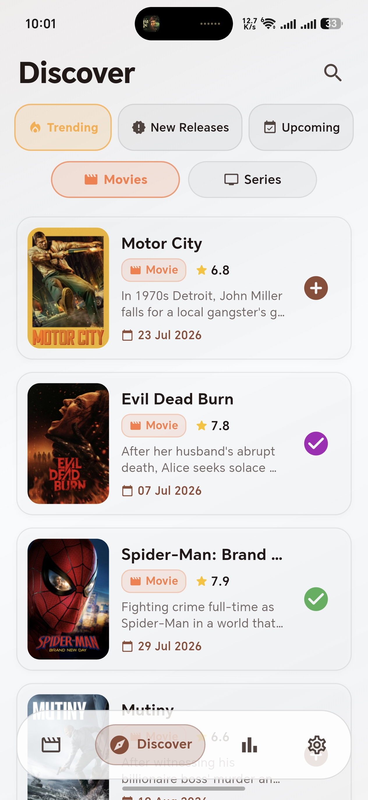
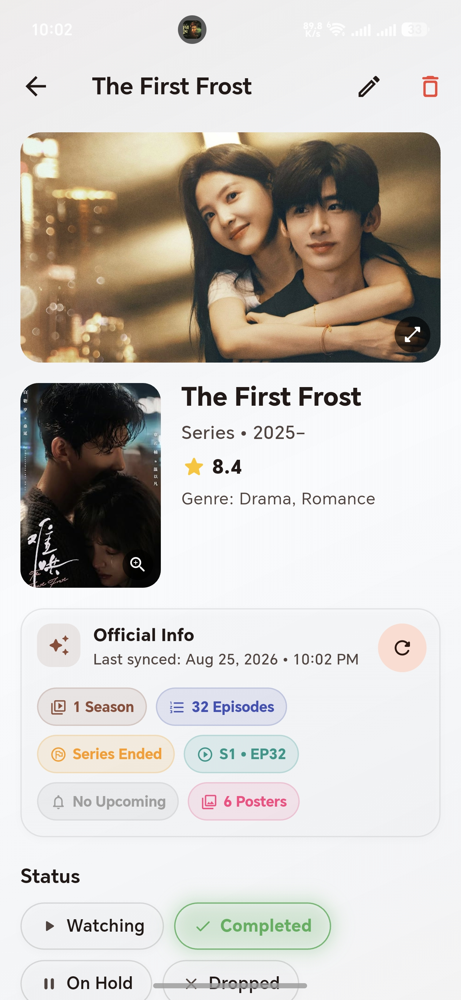
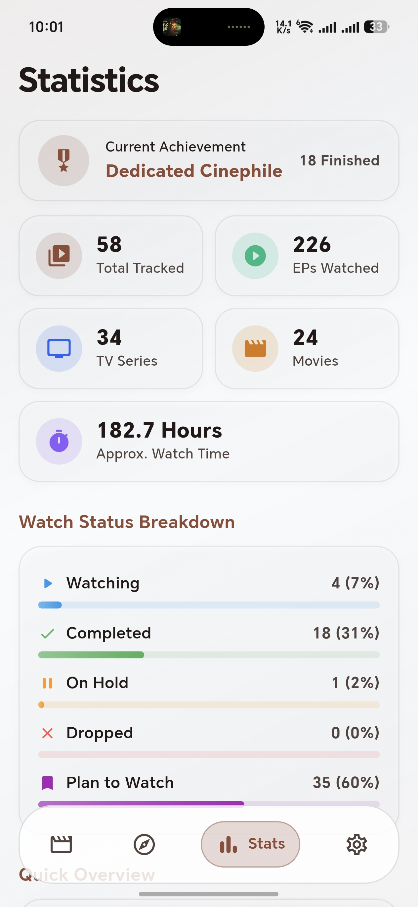
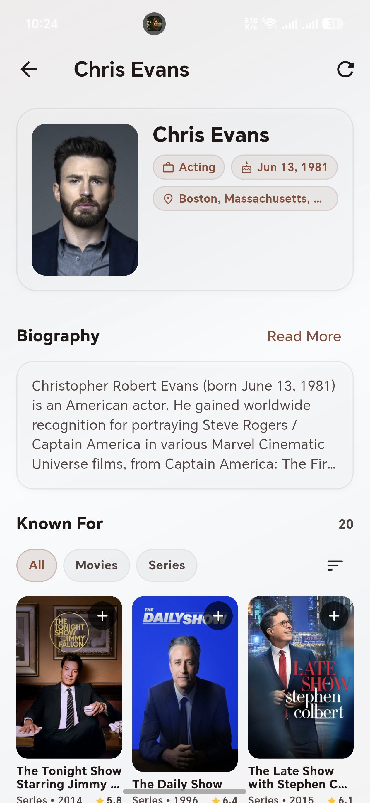
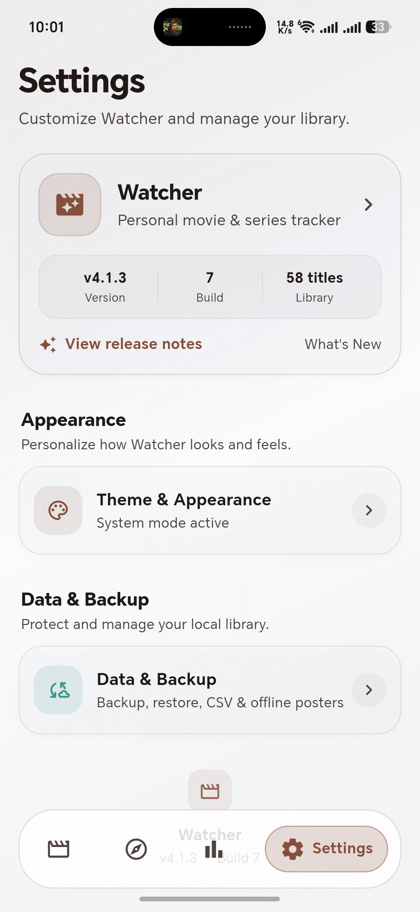

# 🎬 Watcher

<p align="center">
  
</p>

<p align="center">
  A modern Flutter movie & series tracker with smart discovery, progress tracking, and cloud backup.
</p>

---

## ✨ Overview

Watcher is a personal movie and series management app built with Flutter.

It helps you discover new titles, organize your watchlist, track episode progress, and keep your collection
synced with backup support.

## 📥 Download Latest APK

<p align="center">
  <a href="../../releases/latest">
    
  </a>
</p>

---

## 📱 Screenshots

<p align="center">



</p>

<p align="center">



</p>

## 🚀 Features

### 🔎 Smart Discovery

- Trending movies and series
- New releases
- Upcoming releases
- Genre-based browsing
- Search with detailed metadata

### 🎬 Watch Management

- Plan to Watch
- Watching
- Completed
- On Hold
- Progress tracking for seasons and episodes
- Automatic completion handling

### 📚 Detailed Information

- Movie & series details
- Cast and directors
- Person profiles with filmography
- Similar titles recommendation
- Multiple backdrop support

### ☁️ Backup & Sync

- Google Drive backup
- Restore data
- Automatic backup support
- Local data protection

### 🎨 UI & Experience

- Material 3 design
- Light / Dark / System theme
- Android Dynamic Color support
- Glass style UI elements
- Optimized performance

---

## 🛠 Tech Stack

| Technology       | Usage                 |
| ---------------- | --------------------- |
| Flutter          | Application framework |
| Dart             | Programming language  |
| TMDB API         | Movie & series data   |
| OMDb API         | Additional metadata   |
| SQLite           | Local storage         |
| Google Drive API | Backup system         |
| Material 3       | UI design             |

---

## 📦 Installation

### Requirements

- Flutter SDK
- Android Studio
- Android SDK

### Run

```bash
git clone https://github.com/yourname/watcher.git

cd watcher

flutter pub get

flutter run
```
